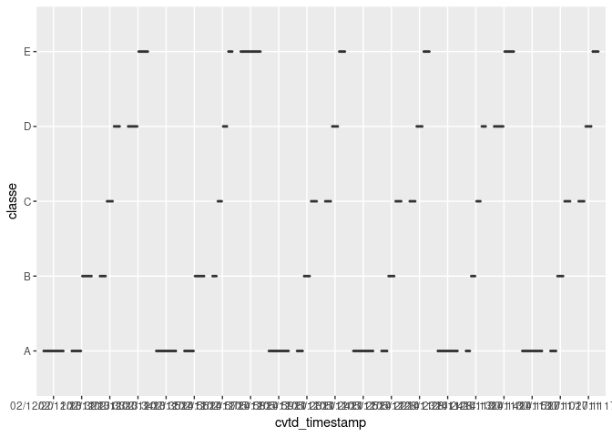
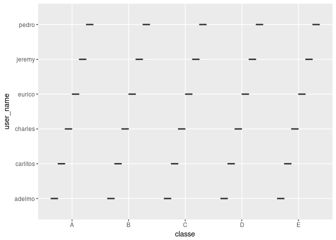

```r
if (!require("pacman"))
  install.packages("pacman", repos = "http://cran.us.r-project.org")
pacman::p_load(knitr, dplyr, ggplot2, GGally, tidyr, car, broom, tibble, caret, data.table, xgboost, class)
```


```r
url1 <- 'https://d396qusza40orc.cloudfront.net/predmachlearn/pml-training.csv'
url2 <- 'https://d396qusza40orc.cloudfront.net/predmachlearn/pml-testing.csv'
destfile1 <- 'pml-training.csv'
destfile2 <- 'pml-testing.csv'
  
if (!file.exists(destfile1))
  download.file(url1, destfile1, method = "auto")
if (!file.exists(destfile2))
  download.file(url2, destfile2, method = "auto")

train <- fread(destfile1, na.strings = c("NA", "", "#DIV/0!"))
test <- fread(destfile2, na.strings = c("NA", "", "#DIV/0!"))

ggplot(train, aes(x=cvtd_timestamp,y=classe)) + geom_boxplot()
```

<!-- -->

```r
ggplot(train, aes(x=classe,y=user_name)) + geom_boxplot()
```

<!-- -->

```r
ytrain <- as.factor(train$classe)
ytest <- as.factor(test$classe)

train <- train[,-160]
test <- test[,-160]

nrows <- dim(train)[1]
dim(test)
```

```
## [1]  20 159
```


```r
na_count <- sapply(train, function(y) sum(is.na(y)))

nacols <- which(na_count>100)
train <- select(train, -nacols)
test <- select(test, -nacols)

str(train)
```

```
## Classes 'data.table' and 'data.frame':	19622 obs. of  59 variables:
##  $ V1                  : int  1 2 3 4 5 6 7 8 9 10 ...
##  $ user_name           : chr  "carlitos" "carlitos" "carlitos" "carlitos" ...
##  $ raw_timestamp_part_1: int  1323084231 1323084231 1323084231 1323084232 1323084232 1323084232 1323084232 1323084232 1323084232 1323084232 ...
##  $ raw_timestamp_part_2: int  788290 808298 820366 120339 196328 304277 368296 440390 484323 484434 ...
##  $ cvtd_timestamp      : chr  "05/12/2011 11:23" "05/12/2011 11:23" "05/12/2011 11:23" "05/12/2011 11:23" ...
##  $ new_window          : chr  "no" "no" "no" "no" ...
##  $ num_window          : int  11 11 11 12 12 12 12 12 12 12 ...
##  $ roll_belt           : num  1.41 1.41 1.42 1.48 1.48 1.45 1.42 1.42 1.43 1.45 ...
##  $ pitch_belt          : num  8.07 8.07 8.07 8.05 8.07 8.06 8.09 8.13 8.16 8.17 ...
##  $ yaw_belt            : num  -94.4 -94.4 -94.4 -94.4 -94.4 -94.4 -94.4 -94.4 -94.4 -94.4 ...
##  $ total_accel_belt    : int  3 3 3 3 3 3 3 3 3 3 ...
##  $ gyros_belt_x        : num  0 0.02 0 0.02 0.02 0.02 0.02 0.02 0.02 0.03 ...
##  $ gyros_belt_y        : num  0 0 0 0 0.02 0 0 0 0 0 ...
##  $ gyros_belt_z        : num  -0.02 -0.02 -0.02 -0.03 -0.02 -0.02 -0.02 -0.02 -0.02 0 ...
##  $ accel_belt_x        : int  -21 -22 -20 -22 -21 -21 -22 -22 -20 -21 ...
##  $ accel_belt_y        : int  4 4 5 3 2 4 3 4 2 4 ...
##  $ accel_belt_z        : int  22 22 23 21 24 21 21 21 24 22 ...
##  $ magnet_belt_x       : int  -3 -7 -2 -6 -6 0 -4 -2 1 -3 ...
##  $ magnet_belt_y       : int  599 608 600 604 600 603 599 603 602 609 ...
##  $ magnet_belt_z       : int  -313 -311 -305 -310 -302 -312 -311 -313 -312 -308 ...
##  $ roll_arm            : num  -128 -128 -128 -128 -128 -128 -128 -128 -128 -128 ...
##  $ pitch_arm           : num  22.5 22.5 22.5 22.1 22.1 22 21.9 21.8 21.7 21.6 ...
##  $ yaw_arm             : num  -161 -161 -161 -161 -161 -161 -161 -161 -161 -161 ...
##  $ total_accel_arm     : int  34 34 34 34 34 34 34 34 34 34 ...
##  $ gyros_arm_x         : num  0 0.02 0.02 0.02 0 0.02 0 0.02 0.02 0.02 ...
##  $ gyros_arm_y         : num  0 -0.02 -0.02 -0.03 -0.03 -0.03 -0.03 -0.02 -0.03 -0.03 ...
##  $ gyros_arm_z         : num  -0.02 -0.02 -0.02 0.02 0 0 0 0 -0.02 -0.02 ...
##  $ accel_arm_x         : int  -288 -290 -289 -289 -289 -289 -289 -289 -288 -288 ...
##  $ accel_arm_y         : int  109 110 110 111 111 111 111 111 109 110 ...
##  $ accel_arm_z         : int  -123 -125 -126 -123 -123 -122 -125 -124 -122 -124 ...
##  $ magnet_arm_x        : int  -368 -369 -368 -372 -374 -369 -373 -372 -369 -376 ...
##  $ magnet_arm_y        : int  337 337 344 344 337 342 336 338 341 334 ...
##  $ magnet_arm_z        : int  516 513 513 512 506 513 509 510 518 516 ...
##  $ roll_dumbbell       : num  13.1 13.1 12.9 13.4 13.4 ...
##  $ pitch_dumbbell      : num  -70.5 -70.6 -70.3 -70.4 -70.4 ...
##  $ yaw_dumbbell        : num  -84.9 -84.7 -85.1 -84.9 -84.9 ...
##  $ total_accel_dumbbell: int  37 37 37 37 37 37 37 37 37 37 ...
##  $ gyros_dumbbell_x    : num  0 0 0 0 0 0 0 0 0 0 ...
##  $ gyros_dumbbell_y    : num  -0.02 -0.02 -0.02 -0.02 -0.02 -0.02 -0.02 -0.02 -0.02 -0.02 ...
##  $ gyros_dumbbell_z    : num  0 0 0 -0.02 0 0 0 0 0 0 ...
##  $ accel_dumbbell_x    : int  -234 -233 -232 -232 -233 -234 -232 -234 -232 -235 ...
##  $ accel_dumbbell_y    : int  47 47 46 48 48 48 47 46 47 48 ...
##  $ accel_dumbbell_z    : int  -271 -269 -270 -269 -270 -269 -270 -272 -269 -270 ...
##  $ magnet_dumbbell_x   : int  -559 -555 -561 -552 -554 -558 -551 -555 -549 -558 ...
##  $ magnet_dumbbell_y   : int  293 296 298 303 292 294 295 300 292 291 ...
##  $ magnet_dumbbell_z   : num  -65 -64 -63 -60 -68 -66 -70 -74 -65 -69 ...
##  $ roll_forearm        : num  28.4 28.3 28.3 28.1 28 27.9 27.9 27.8 27.7 27.7 ...
##  $ pitch_forearm       : num  -63.9 -63.9 -63.9 -63.9 -63.9 -63.9 -63.9 -63.8 -63.8 -63.8 ...
##  $ yaw_forearm         : num  -153 -153 -152 -152 -152 -152 -152 -152 -152 -152 ...
##  $ total_accel_forearm : int  36 36 36 36 36 36 36 36 36 36 ...
##  $ gyros_forearm_x     : num  0.03 0.02 0.03 0.02 0.02 0.02 0.02 0.02 0.03 0.02 ...
##  $ gyros_forearm_y     : num  0 0 -0.02 -0.02 0 -0.02 0 -0.02 0 0 ...
##  $ gyros_forearm_z     : num  -0.02 -0.02 0 0 -0.02 -0.03 -0.02 0 -0.02 -0.02 ...
##  $ accel_forearm_x     : int  192 192 196 189 189 193 195 193 193 190 ...
##  $ accel_forearm_y     : int  203 203 204 206 206 203 205 205 204 205 ...
##  $ accel_forearm_z     : int  -215 -216 -213 -214 -214 -215 -215 -213 -214 -215 ...
##  $ magnet_forearm_x    : int  -17 -18 -18 -16 -17 -9 -18 -9 -16 -22 ...
##  $ magnet_forearm_y    : num  654 661 658 658 655 660 659 660 653 656 ...
##  $ magnet_forearm_z    : num  476 473 469 469 473 478 470 474 476 473 ...
##  - attr(*, ".internal.selfref")=<externalptr>
```

```r
train <- select(train, -c(1:7))
test <- select(test, -c(1:7))
```


```r
set.seed(100)

trainmat <- model.matrix(~.-1,train)
#cvxg <- train(train, ytrain, method='xgboost')
#cvxg <- xgb.cv(params=list('objective'='multi:softprob','eval_metric'='mlogloss','num_class'=5), xgtrain, nrounds=500, nfold=5, label=as.numeric(ytrain)-1, print_every_n=10,early_stopping_rounds = 10)

#cvxg <- xgboost(trainmat, label=as.numeric(ytrain)-1, params=list('objective'='multi:softprob', 'num_class'=5),  nrounds=100)
```


```r
trainpredlong <- predict(cvxg,xgtrain)
trainpredvec <- matrix(trainpredlong, nrow=nrows,byrow=TRUE)

dim(trainpredvec)
trainpred <- apply(trainpredvec, 1,which.max)

trainpred <- factor(trainpred)
levels(trainpred) <- list(A=1,B=2,C=3,D=4,E=5)


confusionMatrix(trainpred, ytrain)
```


```r
knnmod <- knn(trainmat, trainmat, ytrain, k=5)

confusionMatrix(knnmod, ytrain)
```

```
## Confusion Matrix and Statistics
## 
##           Reference
## Prediction    A    B    C    D    E
##          A 5530   59    9   12   11
##          B   15 3635   38    3   28
##          C   13   50 3335   79   24
##          D   20   29   24 3101   42
##          E    2   24   16   21 3502
## 
## Overall Statistics
##                                           
##                Accuracy : 0.9736          
##                  95% CI : (0.9712, 0.9758)
##     No Information Rate : 0.2844          
##     P-Value [Acc > NIR] : < 2.2e-16       
##                                           
##                   Kappa : 0.9665          
##  Mcnemar's Test P-Value : 3.192e-16       
## 
## Statistics by Class:
## 
##                      Class: A Class: B Class: C Class: D Class: E
## Sensitivity            0.9910   0.9573   0.9746   0.9642   0.9709
## Specificity            0.9935   0.9947   0.9898   0.9930   0.9961
## Pos Pred Value         0.9838   0.9774   0.9526   0.9642   0.9823
## Neg Pred Value         0.9964   0.9898   0.9946   0.9930   0.9935
## Prevalence             0.2844   0.1935   0.1744   0.1639   0.1838
## Detection Rate         0.2818   0.1853   0.1700   0.1580   0.1785
## Detection Prevalence   0.2865   0.1895   0.1784   0.1639   0.1817
## Balanced Accuracy      0.9923   0.9760   0.9822   0.9786   0.9835
```
